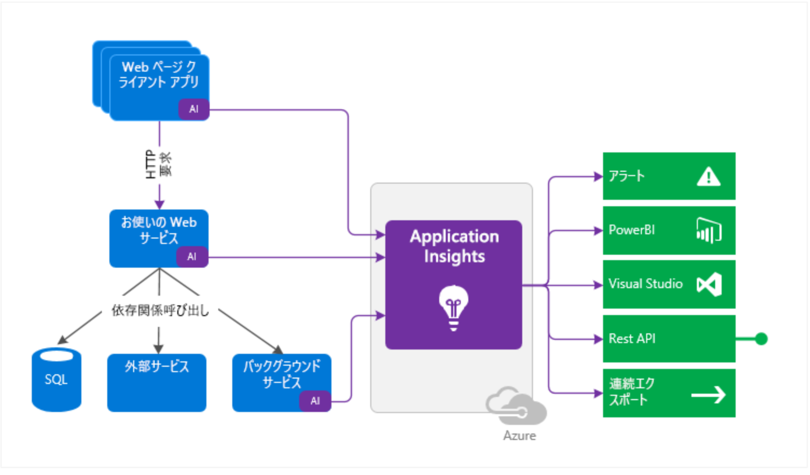
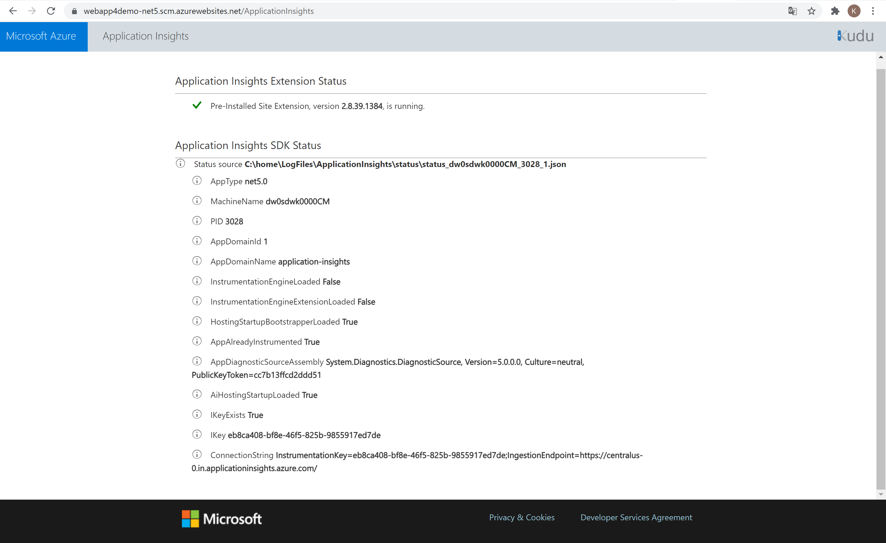
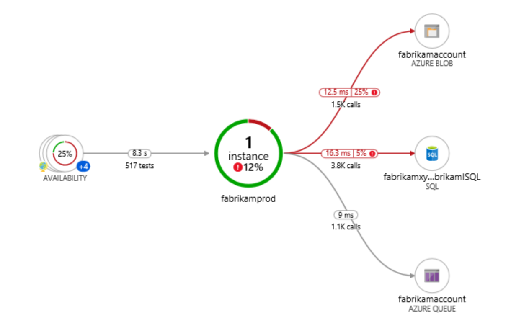
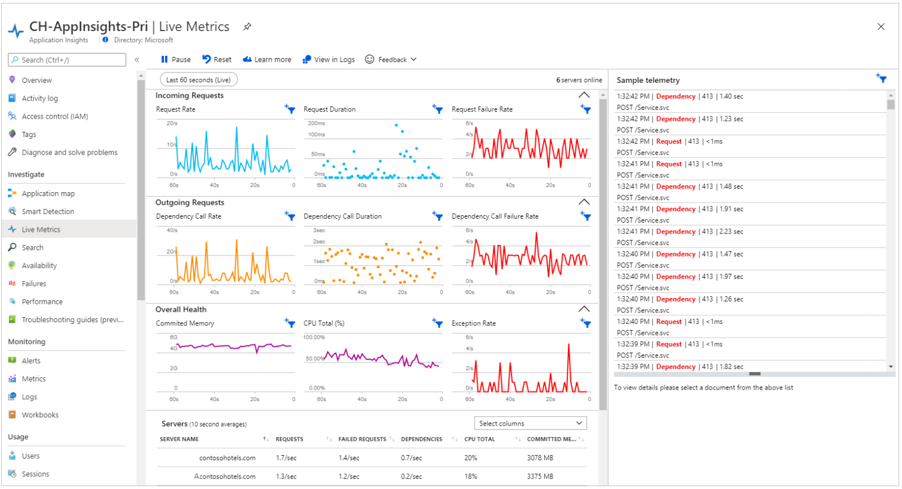
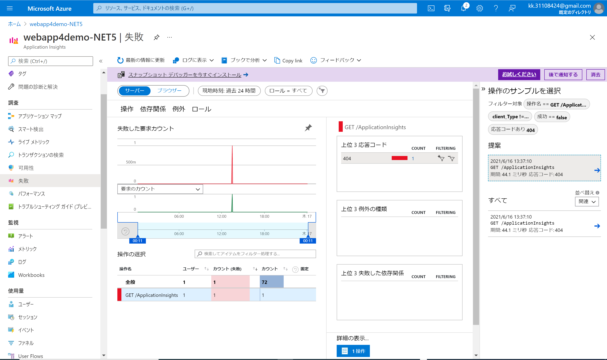
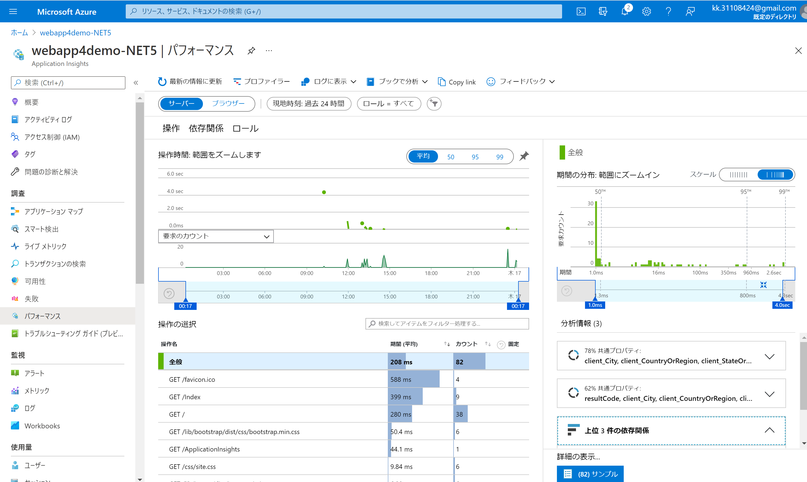

# Application Insights

## 目的

- Application Insights の概要を確認する
- SDK を入れない場合、入れた場合の挙動の違いを確認する
- Portal 上から Application Insights を操作する方法を確認する

## 前提

- Azure Subscription を保有していること

## 結論

- App Service のログを取得するには、 Application Insights を有効化することで実現可能。
    - 取得レベルには 2 段階（Basic / 推奨）あるが、基本的に「推奨」とすることがおススメ。
- パフォーマンス調査をする際は、 Application Insights の各コンポーネント（アプリケーションマップなど）を有効化することを推奨する。
    - パフォーマンス調査など、取り急ぎログを収集したいといったニーズには、 Portal 上で Application Insights の有効化が可能。
    - ログを収集する際の高度なシナリオが存在する場合など、ログ収集に関するカスタマイズが必要な場合は、 SDK をインストールして、コードレベルでログのカスタマイズが可能。ただし、この場合は、 SDK の管理をお客様自身で行っていただく必要がある。使用可能な API は、[カスタムのイベントとメトリックのための Application Insights API](https://docs.microsoft.com/ja-jp/azure/azure-monitor/app/api-custom-events-metrics)を参照すること。

## Application Insights とは

Azure Monitor の機能の一つであり、開発者や DevOps プロフェッショナル向けの拡張可能な Application Performance Management サービス。これを使用して、実行中のアプリケーションの監視が可能。パフォーマンスの以上を自動的に検出し、ビルトインの分析ツールを使用して問題を診断し、ユーザがアプリケーションで行っている操作の確認が可能。

## Application Insights 仕組み

有効化の方法は下記の 2 つ。

- <b>アプリケーションに SDK をインストール</b>
    - 最も簡単な有効化方法。高度な構成は不要。 Azure App Service では、少なくともこの方式は有効化することを推奨している。
    - `d:\Program Files (x86)\SiteExtensions\ApplicationInsightsAgent` に、 Application Insights の最新の安定版リリースがインストールされる。
- <b>Application Insights エージェントを使用（[サポートされている場合](https://docs.microsoft.com/ja-jp/azure/azure-monitor/app/platforms)のみ可能）</b>
    - カスタマイズ可能な方式。 [Application Insights SDK NuGet パッケージへの依存関係を追加](https://docs.microsoft.com/ja-jp/azure/azure-monitor/app/asp-net)する必要がある。また、最新バージョンのパッケージへの更新をお客様自身が行う必要がある。

SDK によってアプリケーションの監視が行われる。インストルメンテーションキーという一意の GUID を使用して、テレメトリデータが Azure Application Insights リソースに転送される。



上記のテレメトリストリームは、 Azure Monitor に統合されている。アプリケーションのパフォーマンスへの影響は最小限にとどめるように設計されている。トレース、メソッドコールはブロッキングを行わず、バッチ処理された後、別スレッドにて送信される。

## Application Insights 有効化

ASP.NET アプリケーションの監視は既定で有効化されており、 2 つの異なる収集レベルがある。

| Data | ASP.NET 基本収集 | ASP.NET 推奨収集 |
| :--- | :--- | :--- |
| CPU、メモリ、および I/O の使用状況の傾向が追加されます | はい | はい |
| 使用状況の傾向が収集され、可用性の結果からトランザクションへの相関関係が有効になります | はい | はい |
| ホストプロセスによって処理されていない例外が収集されます | はい | はい |
| 負荷がかかっているときの APM メトリックの精度が上がります (サンプリングが使用される場合) | はい | はい |
| 要求/依存関係の境界を越えてマイクロサービスが相互に関連付けられます | いいえ (シングルインスタンス APM 機能のみ) | はい |

収集レベルは、Azure Portal 上で設定可能。または、 `XDT_MicrosoftApplicationInsights_Mode` を `default` or `recommended` のどちらかに指定することで制御可能。
Basic モードでは、アプリケーションに対し、最適なパフォーマンスを保証するため、重要な機能のみが有効化される。

（参考：[アプリケーション設定の定義](https://docs.microsoft.com/ja-jp/azure/azure-monitor/app/azure-web-apps?tabs=net#application-settings-definitions)）

[アプリケーション設定]にて、Application Insights を使用したテレメトリの収集に関する構成を設定可能。

SDK をインストールせずに制御可能なパラメータは下記の通り。

| パラメータ | 概要 | 参考 |
| :---: | :--- | :--- |
| Profiler | プログラムの実行中にそのプログラムの動作についての情報を収集するプロセス。`APPINSIGHTS_PROFILERFEATURE_VERSION` にて制御する。 | [Application Insights を使用したライブ Azure App Service アプリのプロファイリング](https://docs.microsoft.com/ja-jp/azure/azure-monitor/app/profiler) |
| スナップショットデバッガ― | 例外がスローされた際に、アプリケーションのコールスタックを収集する。`APPINSIGHTS_SNAPSHOTFEATURE_VERSION` にて制御する。 | [.NET アプリでの例外でのデバッグ スナップショット](https://docs.microsoft.com/ja-jp/azure/azure-monitor/app/snapshot-debugger) |
| SQL コマンド | 依存関係の追跡を有効にして、Web 要求のコンパイル済み SQL コマンドとローカル変数を表示する | [詳細な SQL 追跡で完全な SQL クエリを取得する](https://docs.microsoft.com/ja-jp/azure/azure-monitor/app/asp-net-dependencies#advanced-sql-tracking-to-get-full-sql-query) |

## Application Insights SDK で収集されるテレメトリ

Application Insights SDK を使用した際に収集されるテレメトリは下記の通り。

- ライブメトリック
- ILogger ログ
- 依存関係の収集
- パフォーマンスカウンター
- EventCounter
- アプリケーションへのリクエスト

## SDK と拡張機能の相互運用

`XDT_MicrosoftApplicationInsights_PreemptSdk` にて制御可能。ASP.NET Core アプリの場合のみ設定可能。 Application Insights SDK で相互運用を有効にし、拡張機能を SDK とサイドバイサイドで読み込み、それを使用してテレメトリを送信する (Application Insights SDK を無効にします)。

### SDK を入れていない場合と入れた場合の比較

以下、 SDK を入れていない場合と入れた場合の双方で、 Azure Portal 上からどのようにテレメトリを確認できるかを示す。

#### SDK なし / 収集レベル：Basic（.NET） / 無効 (.NET Core)

- アプリケーションマップ；利用できるデータがありません。
- ライブメトリック：使用できません: アプリがオフラインであるか、前の SDK を使用しています
- トランザクションの検索：この期間内のデータがありません。
- パフォーマンス：利用できるデータはありません。

#### SDK なし / 収集レベル：推奨 (.NET / .NET Core)

- アプリケーションマップ；利用できるデータがありません。
- ライブメトリック：使用可能。
- トランザクションの検索：この期間内のデータがありません。
- パフォーマンス：利用できるデータはありません。

#### SDK あり / 収集レベル：推奨 (.NET / .NET Core) / Application Insights SDK との相互運用 (プレビュー)：オフ

- アプリケーションマップ；利用可能。
- ライブメトリック：利用可能。
- トランザクションの検索：利用可能。
- パフォーマンス：利用可能。

#### SDK あり / 収集レベル：推奨 (.NET / .NET Core) / Application Insights SDK との相互運用 (プレビュー)：オン

- アプリケーションマップ；利用可能。
- ライブメトリック：利用可能。
- トランザクションの検索：利用可能。
- パフォーマンス：利用可能。

### Application Insights SDK のインストール方法

1. `*.csproj` に `ItemGroup` として Application Insights SDK を追加。

```xml
    <ItemGroup>
      <PackageReference Include="Microsoft.ApplicationInsights.AspNetCore" Version="2.16.0" />
    </ItemGroup>
```

2. `Startup` クラスで `ConfigureServices()` メソッドに `services.AddApplicationInsightsTelemetry();` を追加。

```C#
    // This method gets called by the runtime. Use this method to add services to the container.
    public void ConfigureServices(IServiceCollection services)
    {
        // The following line enables Application Insights telemetry collection.
        services.AddApplicationInsightsTelemetry();

        // This code adds other services for your application.
        services.AddMvc();
    }
```

3. `appsettings.json` にインストルメンテーションキーを設定

```
    {
      "ApplicationInsights": {
        "InstrumentationKey": "putinstrumentationkeyhere"
      },
      "Logging": {
        "LogLevel": {
          "Default": "Warning"
        }
      }
    }
```

手順 3 は、環境変数や Azure Keyとして指定してもよい。

### SDK をアプリケーションにインストールした際のデプロイメントログ

Application Insights のライブラリもデプロイされていることがわかる。

```
13:03:26 webapp4demo-NET5: Starting deployment...
13:03:27 webapp4demo-NET5: Creating zip package...
13:03:31 webapp4demo-NET5: Zip package size: 1.98 MB
13:03:51 webapp4demo-NET5: Updating submodules.
13:03:51 webapp4demo-NET5: Preparing deployment for commit id '6f789b5f2b'.
13:03:51 webapp4demo-NET5: Generating deployment script.
13:03:51 webapp4demo-NET5: Using cached version of deployment script (command: 'azure -y --no-dot-deployment -r "C:\local\Temp\zipdeploy\extracted" -o "C:\home\site\deployments\tools" --basic --sitePath "C:\local\Temp\zipdeploy\extracted"').
13:03:51 webapp4demo-NET5: Running deployment command...
13:03:51 webapp4demo-NET5: Command: "C:\home\site\deployments\tools\deploy.cmd"
13:03:56 webapp4demo-NET5: Handling Basic Web Site deployment.
13:03:59 webapp4demo-NET5: Creating app_offline.htm
13:03:59 webapp4demo-NET5: KuduSync.NET from: 'C:\local\Temp\zipdeploy\extracted' to: 'C:\home\site\wwwroot'
13:03:59 webapp4demo-NET5: Copying file: 'application-insights.deps.json'
13:03:59 webapp4demo-NET5: Copying file: 'application-insights.dll'
13:03:59 webapp4demo-NET5: Copying file: 'application-insights.exe'
13:03:59 webapp4demo-NET5: Copying file: 'application-insights.pdb'
13:03:59 webapp4demo-NET5: Copying file: 'application-insights.runtimeconfig.json'
13:03:59 webapp4demo-NET5: Copying file: 'application-insights.Views.dll'
13:03:59 webapp4demo-NET5: Copying file: 'application-insights.Views.pdb'
13:03:59 webapp4demo-NET5: Copying file: 'appsettings.json'
13:03:59 webapp4demo-NET5: Copying file: 'Microsoft.AI.DependencyCollector.dll'
13:03:59 webapp4demo-NET5: Copying file: 'Microsoft.AI.EventCounterCollector.dll'
13:03:59 webapp4demo-NET5: Copying file: 'Microsoft.AI.PerfCounterCollector.dll'
13:03:59 webapp4demo-NET5: Copying file: 'Microsoft.AI.ServerTelemetryChannel.dll'
13:03:59 webapp4demo-NET5: Copying file: 'Microsoft.AI.WindowsServer.dll'
13:03:59 webapp4demo-NET5: Copying file: 'Microsoft.ApplicationInsights.AspNetCore.dll'
13:03:59 webapp4demo-NET5: Copying file: 'Microsoft.ApplicationInsights.dll'
13:03:59 webapp4demo-NET5: Copying file: 'Microsoft.Extensions.Logging.ApplicationInsights.dll'
13:03:59 webapp4demo-NET5: Copying file: 'Newtonsoft.Json.dll'
13:03:59 webapp4demo-NET5: Copying file: 'System.Configuration.ConfigurationManager.dll'
13:03:59 webapp4demo-NET5: Copying file: 'System.Diagnostics.PerformanceCounter.dll'
13:03:59 webapp4demo-NET5: Copying file: 'System.Security.Cryptography.ProtectedData.dll'
13:03:59 webapp4demo-NET5: Copying file: 'runtimes\win\lib
13:03:59 webapp4demo-NET5: etcoreapp2.0\System.Diagnostics.PerformanceCounter.dll'
13:03:59 webapp4demo-NET5: Copying file: 'runtimes\win\lib
13:03:59 webapp4demo-NET5: etstandard2.0\System.Security.Cryptography.ProtectedData.dll'
13:04:00 webapp4demo-NET5: Deleting app_offline.htm
13:04:00 webapp4demo-NET5: Finished successfully.
13:04:00 webapp4demo-NET5: Running post deployment command(s)...
13:04:00 webapp4demo-NET5: Triggering recycle (preview mode disabled).
13:04:00 webapp4demo-NET5: Deployment successful.
13:03:55: Deployment to "webapp4demo-NET5" completed.
```

Application Insights SDK を含んだアプリケーションをデプロイすると、内部的には、`C:\home\LogFiles\ApplicationInsights\status\status_<Machine_name>_<pid>_<AppDomainId>.json` というファイルが作成される。以下に、今回のサンプルアプリケーションで作成されたファイルを示す。

```json:status_dw0sdwk0000CM_3028_1.json
{
"AppType":"net5.0",
"MachineName":"dw0sdwk0000CM",
"PID":"3028",
"AppDomainId":"1",
"AppDomainName":"application-insights",
"InstrumentationEngineLoaded":false,
"InstrumentationEngineExtensionLoaded":false,
"HostingStartupBootstrapperLoaded":true,
"AppAlreadyInstrumented":true,
"AppDiagnosticSourceAssembly":"System.Diagnostics.DiagnosticSource, Version=5.0.0.0, Culture=neutral, PublicKeyToken=cc7b13ffcd2ddd51",
"AiHostingStartupLoaded":true,
"IKeyExists":true,
"IKey":"eb8ca408-bf8e-46f5-825b-9855917ed7de",
"ConnectionString":"InstrumentationKey=eb8ca408-bf8e-46f5-825b-9855917ed7de;IngestionEndpoint=https://centralus-0.in.applicationinsights.azure.com/"
}
```

Application Insights SDK のステータスは、以下の URL にアクセスすることで、ブラウザからも確認可能。

- `https://yoursitename.scm.azurewebsites.net/ApplicationInsights`



以前に ASP.NET Core SDK を使用してアプリケーションをインストールした場合、 App Service との統合はデフォルトではできず、 Application Insights にデータが表示されない。これを解決するには、ポータルで「Application Insights SDK との相互運用 (プレビュー)」を `オン` にする必要がある。オンにすると、 Application Insights にデータが表示される。

但し、アプリケーションが Application Insights SDK を使用してテレメトリを送信していた場合、そうしたテレメトリ（カスタムテレメトリ）は無効になる。

（参考：[トラブルシューティング](https://docs.microsoft.com/ja-jp/azure/azure-monitor/app/azure-web-apps?tabs=net#troubleshooting)）

## クライアントの監視有効化

### Application Insights SDK を使用しない場合

| Language | 有効 / 無効 |
| :---: | :--- |
| ASP.NET | オプトイン。[設定] > [構成] > [アプリケーション設定]で、<b>新しいアプリケーション設定</b>を作成する。`APPINSIGHTS_JAVASCRIPT_ENABLED` : `true` とし、設定保存後アプリケーションを再起動する。 |
| ASP.NET Core | アプリケーション設定 `APP_INSIGHTS_ENABLED` の有無に関係なく、ASP.NET Core アプリと<b>推奨収集</b>の組み合わせの場合、クライアント側の監視は既定で有効となる。無効化するには、`APPINSIGHTS_JAVASCRIPT_ENABLED` : `false` の設定を保存し、アプリケーションを再起動する。 |

設定可能なパラメータは、[アプリケーション設定の定義](https://docs.microsoft.com/ja-jp/azure/azure-monitor/app/azure-web-apps?tabs=netcore#application-settings-definitions)を参照すること。

### Application Insights SDK を使用する場合

1. `_ViewImports.cshtml` で、インジェクションを追加。

```cshtml
@inject Microsoft.ApplicationInsights.AspNetCore.JavaScriptSnippet JavaScriptSnippet
```

2. `_Layout.cshtml` で、`<head>` セクションの終わりに `HtmlHelper` を挿入する。

```cshtml
    @Html.Raw(JavaScriptSnippet.FullScript)
    </head>
```

（参考：[Web アプリケーションに対してクライアント側のテレメトリを有効にする](https://docs.microsoft.com/ja-jp/azure/azure-monitor/app/asp-net-core#enable-client-side-telemetry-for-web-applications)）

## Application Insights 各コンポーネント

以下、 Application Insights を構成する各コンポーネントを示す。以下を確認するには、サポートされている SDK をアプリケーションにインストールする必要がある。（参考：[サポートされている言語](https://docs.microsoft.com/ja-jp/azure/azure-monitor/app/platforms)）

### アプリケーションマップ

アプリケーションマップを利用すると、分散アプリケーションのすべてのコンポーネントを対象に、パフォーマンスのボトルネックや障害のホットスポットを特定可能。ここでいう「分散アプリケーションのコンポーネント」とは、分散 / マイクロサービスで個別にデプロイ可能なアプリケーションを指す。



（参考：[アプリケーション マップ:分散アプリケーションのトリアージ](https://docs.microsoft.com/ja-jp/azure/azure-monitor/app/app-map?tabs=net)）

### スマート検出

スマート検出により、 Web アプリケーションの潜在的なパフォーマンスの問題をプロアクティブに検出可能。例えば、障害発生率が急激に上昇したり、クライアントまたはサーバのパフォーマンスに異常なパターンが検出された際に、アラートが表示される。スマート検出を構成する設定は不要で、アプリケーションからテレメトリが送信されていれば、自動的に有効化される。

一例として、下記の検知が可能。

- 失敗の異常。 機械学習を使用して、負荷などの要因と関連付けて、アプリの要求が失敗すると予想される率を設定します。 障害発生率が、予想の包絡線を超えた場合、アラートが送信される（参考：[スマート検出 - 失敗の異常](https://docs.microsoft.com/ja-jp/azure/azure-monitor/app/proactive-failure-diagnostics)）
- パフォーマンスの異常。 操作の応答時間または依存関係の継続期間が過去の基準と比較して低下している場合や、応答時間またはページの読み込み時間に異常なパターンが特定された場合は、通知を受信する。（参考：[スマート検出 - パフォーマンスの異常](https://docs.microsoft.com/ja-jp/azure/azure-monitor/app/proactive-performance-diagnostics)）
- トレースの低下、メモリ リーク、例外数の異常な上昇、セキュリティ アンチ パターンなど、一般的な低下および問題。（参考：[トレースの重大度の比率の低下 (プレビュー)](https://docs.microsoft.com/ja-jp/azure/azure-monitor/app/proactive-trace-severity) / [メモリ リーク検出 (プレビュー)](https://docs.microsoft.com/ja-jp/azure/azure-monitor/app/proactive-potential-memory-leak) / [例外数の異常な上昇 (プレビュー)](https://docs.microsoft.com/ja-jp/azure/azure-monitor/app/proactive-exception-volume) / [アプリケーション セキュリティ検出パック (プレビュー)](https://docs.microsoft.com/ja-jp/azure/azure-monitor/app/proactive-application-security-detection-pack)）

デフォルトでは、サブスクリプションの監視共同作成者と監視閲覧者に電子メールを送信する設定となっている。送信先を追加することも可能。

（参考：[Application Insights のスマート検出](https://docs.microsoft.com/ja-jp/azure/azure-monitor/app/proactive-diagnostics)）

### Live Metric Stream

実稼働中の Web アプリケーションに対し、リアルタイムでメトリックを監視可能なサービス。ASP.NET / ASP.NET Core では、デフォルトで有効になっている。



（参考：[Live Metrics Stream:1 秒の待機時間での監視と診断](https://docs.microsoft.com/ja-jp/azure/azure-monitor/app/live-stream)）

### 可用性

アプリケーションをデプロイ後、繰り返し実行するテストを設定して、可用性と応答性を監視できる。世界各地の複数のポイントから定期的にアプリケーションにリクエストを送信し、応答が返ってこないまたは応答が遅延している場合は、アラートを送信する。

可用性テストには、下記 3 種類がある。

- URL の ping テスト: ポータルから作成可能。
- 複数ステップ Web テスト:一連のリクエストの記録であり、さらに複雑なシナリオをテストするために再生できます。 複数ステップ Web テストは Visual Studio Enterprise で作成され、ポータルにアップロードされて実行される。
- カスタム可用性追跡テスト:可用性テストを実行するカスタム アプリケーションを作成する場合は、`TrackAvailability()` メソッドをオーバーライドする形で、 Application Insights に結果を送信できる。

（参考：[可用性テストの概要](https://docs.microsoft.com/ja-jp/azure/azure-monitor/app/availability-overview)）

### 失敗

発生したエラーを確認可能。エラーに関してドリルダウンして原因を調査することも可能。



### パフォーマンス

サーバー側、クライアント側それぞれのパフォーマンスを可視化して調査することが可能。



## ARM Template での設定

以下のように、プロパティとして `siteConfig` に組み込むことが可能。

```arm
{
    "resources": [
        {
            "name": "[parameters('name')]",
            "type": "Microsoft.Web/sites",
            "properties": {
                "siteConfig": {
                    "appSettings": [
                        {
                            "name": "APPINSIGHTS_INSTRUMENTATIONKEY",
                            "value": "[reference('microsoft.insights/components/AppMonitoredSite', '2015-05-01').InstrumentationKey]"
                        },
                        {
                            "name": "APPLICATIONINSIGHTS_CONNECTION_STRING",
                            "value": "[reference('microsoft.insights/components/AppMonitoredSite', '2015-05-01').ConnectionString]"
                        },
                        {
                            "name": "ApplicationInsightsAgent_EXTENSION_VERSION",
                            "value": "~2"
                        }
                    ]
                },
・・・
```

## ログ、メトリックの確認

```
requests
```

ストリーミングタイムアウトの設定は、`SCM_LOGSTREAM_TIMEOUT` にて可能。 Basic レベルの Application Insights だと、ストリーミングをしてくれないので注意すること。

## アラート設定

[Application Insights] > [アラート] から設定可能。

## References

- [Application Insights とは何か?](https://docs.microsoft.com/ja-jp/azure/azure-monitor/app/app-insights-overview)